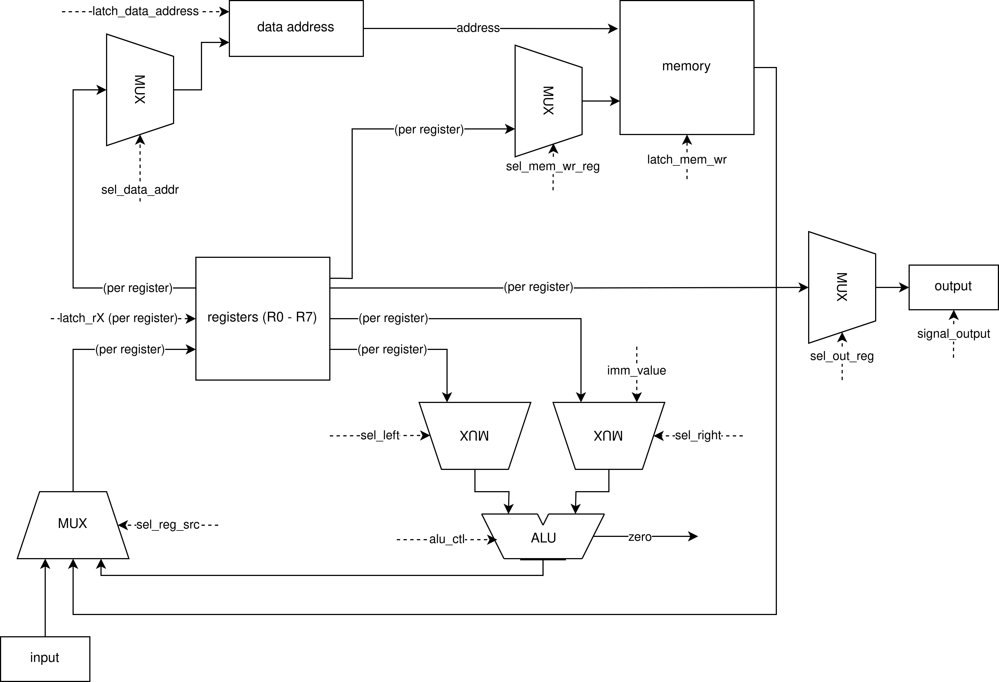

# drum

**Выполнил**: Султанов Артур Радикович, P3213

**Вариант**:

```text
alg -> asm | risc | neum | hw | instr | binary -> struct | stream | port | cstr | prob1 | cache
```

Без усложнения, упрощенный.

**Итоговый вариант**:

```text
asm | risc | neum | hw | instr | struct | stream | port | cstr | prob1 |
```

## Язык программирования

```ebnf
<digit> ::= "0" | "1" | "2" | "3" | "4" | "5" | "6" | "7" | "8" | "9"
<positive-number> ::= <digit> <positive-number>
<number> ::= "-"? <positive-number>
<letter> ::= "A" | "B" | "C" | "D" | "E" | "F" | "G" | "H" | "I" | "J" | "K" | "L" | "M" | "N" | "O" | "P" | "Q" | "R" | "S" | "T" | "U" | "V" | "W" | "X" | "Y" | "Z" | "a" | "b" | "c" | "d" | "e" | "f" | "g" | "h" | "i" | "j" | "k" | "l" | "m" | "n" | "o" | "p" | "q" | "r" | "s" | "t" | "u" | "v" | "w" | "x" | "y" | "z"

<starting-symbol> ::= <letter> | "_"
<symbol> ::= <starting-symbol> | digit

<whitespace> ::= " " | "\t"
<whitespace-plus> ::= <whitespace> <whitespace-plus> | <whitespace>

<label> ::= <starting-symbol> <symbol>*
<label-defenition> ::= <label> ":"

<text> ::= "" | symbol (<text>)
<string-literal> ::= '"' <text> '"'

<line-end> ::= <whitespace-plus> "EOL" | "EOL"

<comment> ::= <whitespace-plus> ";" <whitespace-plus> <text>

<number-literal> ::= "#" <number>

<op-zero> ::= "HLT"
<op-r> ::= "IN" | "OUT"
<op-rr> ::= "ST" | "LD" | 
<op-rrr> ::= "ADD" | "SUB" | "SHR" | "XOR" | 
<op-rri> ::= "ADDI" | "SUBI" | "SHRI" | "XORI" | "BEQ" | "BNE" | "BLT" | "BLE" | "BGT" | "BGE"
<op> ::= <op-zero> | <op-r> | <op-rr> | <op-rrr> | <op-rri>

<register> ::= "R0" | "R1" | "R2" | "R3" | "R4" | "R5" | "R6" | "R7"
<argument-register> ::= "%" <register>
<argument-immediate> ::= <label> | <number>

<arg-sep> ::= "," <whitespace-plus>
<instruction-zero> ::= <op-zero>
<instruction-r> ::= <op-r> <arg-sep> <argument-register>
<instruction-rr> ::= <op-r> <arg-sep> <argument-register> <arg-sep> <argument-register>
<instruction-rrr> ::= <op-r> <arg-sep> <argument-register> <arg-sep> <argument-register> <arg-sep> <argument-register>
<instruction-rri> ::= <op-r> <arg-sep> <argument-register> <arg-sep> <argument-register> <arg-sep> <argument-immediate>
<instruction> ::= <instruction-zero> | <instruction-r> | <instruction-rr> | <instruction-rrr> | <instruction-rri>
<instruction-line> ::= <instruction> <line-end> | <instruction> <arg-sep> <comment> <line-end>

<line> ::= <label-defenition> | <instruction-line> | <comment> | <string-literal> | <number-literal> | <line-end>

<program> ::= <line> | <line> <program>
```

Синтаксически, язык похож на ассемблер (некоторые из фич cхожи с GASM, NASM). Регистры идут с префиксом `%`, числа и лейблы в аргументах - без префиксов:

```drum
_start:
ADDI %R0, %R1, 123
```

Все определения лейблов должны быть уникальными. Лейбл может быть объявлен _после_ обращения к нему.

`_start` - особый лейбл, указывающий на начало программы. Обязан быть в любой программе.

### Константы

Имеется поддержка констант. Число-константа начинается с префикса `#`, строка просто оборачивается в двойные кавычки:

```drum
NUMBER:
#123

STRING:
"howdy"
```

Строки - нуль-терминируются, как в Си, при том хранятся по символу на машинное слово. Числа - 32-битные, знаковые.

### Комментарии

Поддерживются комментарии (префикс - `;`):

```drum
; program start
_start:
XOR %R0, %R0, %R0  ; preparing variables
```

### Инструкции

Порядок аргументов:

- Для арифметических, битовых операций, первый аргумент - назначение, последующие - операнды операции:

    ```drum
    ADD %R0, %R1, %R2  ; R0 = R1 + R2
    ```

- Для операций ввода-вывода, аргументом является регистр, значение которого нужно прочитать/записать:

    ```drum
    OUT %R0  ; print R0 value
    ```

- Для операций переходов, первыми двумя аргументами идут операнды для проверок, последним - назначение:

    ```drum
    BEQ %R0, %R1, LOOP_END  ; goto LOOP_END if R0 == R1
    ```

Ввод-вывод оперирует байтами.

### Область видимости

Понятие "переменная" отстутвует, регистры глобальны.

Все метки глобальны.

## Организация памяти

Фон Неймановская архитектура - данные и программа в одном "месте".

### Регистры

```text
r0-r7 (регистры общего назначения)
da (data_address, регистр, указывающий на место в памяти)
ip (instruction_pointer, регистр, указывающий на инструкцию для исполнения)
ar (alu_result, результат работы ALU)
```

В распоряжении разработчика имеются 8 регистров общего назначения - сама машина их не использует, поэтому их можно использовать как угодно.

`da` и `ip` напрямую недоступны разработчику.

### Память

Длина машинного слова - 4 байта.

При трансляциии, инструкции и литералы кладутся "как есть" - то есть в порядке, в котором они представлены в исходном коде.

Строки хранятся по символу на слово.

Вся память доступна для чтения и записи.

Изначально, весь код программы и данные кладутся на нулевой адрес. В "скомпилированной" программе имеется указатель на начало программы (вычисляется с помощью метки `_start`).

Работа с памятю производится с помощью `LD`, `ST` - в регистре-источнике/назначении находится адрес (прямая абсолютная адресация).

## Система команд

Типы операндов:

- `immediate` - Константа (числовая) / метка. На этапе трансляции, обращение к метке заменяется ее адресом.
- `register` - Регистр

### Набор инструкций

- `HLT` - прекратить исполнение программы
- `ADD dst, reg1, reg2` - положить в регистр `dst` результат сложения регистров `reg1`, `reg2`
- `ADDI dst, reg1, imm2` - положить в регистр `dst` результат сложения регистра `reg1` и значения `imm2`
- `SUB dst, reg1, reg2` - положить в регистр `dst` результат `reg1 - reg2`
- `SUBI dst, reg1, imm2` - положить в регистр `dst` результат `reg1 - imm2`
- `SHR dst, reg1, reg2` - положить в регистр `dst` результат `reg1 >> reg2`
- `SHRI dst, reg1, imm2` - положить в регистр `dst` результат `reg1 >> imm2`
- `XOR dst, reg1, reg2` - положить в регистр `dst` результат `reg1 ^ reg2`
- `XORI dst, reg1, imm2` - положить в регистр `dst` результат `reg1 ^ imm2`
- `ST dst, src` - записать в память, по адресу, равному значению регистра `dst` значение, лежащее в регистре `src`
- `LD dst, src` - прочитать из памяти, по адресу, равному значению регистра `src` и записать значение в регистр `dst`
- `IN reg` - прочитать из stdin 1 байт, записать значени в регистр `reg` (все старшие разряды перетираются)
- `OUT reg` - вывести в stdout младший байт регистра `reg`
- `BEQ reg1, reg2, place` - переход (`ip = place`) на `place`, если значение регистров `reg1`, `reg2` равны
- `BNE reg1, reg2, place` - переход на `place`, если значение регистров `reg1`, `reg2` не равны
- `BLT reg1, reg2, place` - переход на `place`, если `reg1 < reg2`
- `BLE reg1, reg2, place` - переход на `place`, если `reg1 <= reg2`
- `BGT reg1, reg2, place` - переход на `place`, если `reg1 > reg2`
- `BGE reg1, reg2, place` - переход на `place`, если `reg1 >= reg2`

### Кодирование

Инструкции кодируются в json в формате массива числел, пример:

```text
ADD %R0, %R1, 76  ; [2, 0, 1, 76]
```

Где первое число - опкод, последующие - аргументы по порядку.

## Транслятор

CLI:

```bash
$ ./drumc.py
usage: ./drumc.py src_file[.dr] output_file[.drc]
```

Запускается через `./drumc.py`.

Реализован в модуле [compiler](drum/compiler/).

Трансляция происходит в два этапа:

- Сначала [лексер](drum/compiler/lexer.py) бьет текст на токены, соблюдая установленные синтаксисом правила, игнорируя лишние пробелы, пустые строки и пр. Делается для упрощения логики непосредственно парсинга. Идейно вдохновлено докладом Rob Pike [Lexical Scanning in Go](https://www.youtube.com/watch?v=HxaD_trXwRE)
- После, [парсер (транслятор)](drum/compiler/translator.py), читает токены и постепенно собирает из них машинные слова - либо инструкции, либо литералы. Предварительно им производится вычисление и подстановка меток. В конечном итоге получается json, который содержит в себе адрес начала программы (`_start`) и непосредственно программа ("массив кортежей чисел" - кортежи/списки используются исключительно для удобства работы и избежания необходимости написания логики работы с битами)

## Модель процессора

CLI:

```bash
$ ./drumr.py -h
usage: drumr.py [-h] [-O {str,ints,hex-ints,bytes,hex-bytes}] [-L LOGFILE] compiled_file input_file

positional arguments:
  compiled_file         Compiled (.drc) file
  input_file            Input data file

options:
  -h, --help            show this help message and exit
  -O {str,ints,hex-ints,bytes,hex-bytes}, --output-format {str,ints,hex-ints,bytes,hex-bytes}
                        Output data format
  -L LOGFILE, --logfile LOGFILE
                        Output data format
```

Реализовано в модуле [machine](drum/machine/).

Сам по себе вывод является массивом байтов, для удобства на уровне реализации на Python, поддерживаются различные форматы вывода (ints, str, и т.д.)

### DataPath



Реализован в классе `DataPath`.

`DataPath` принимает от `ControlUnit` сигналы:

- `latch_data_address` - Записать в `data_address` значение из выбранного регистра (источник выбирается `sel_data_addr`)
- `latch_mem_wr` - Записать в ячейку памяти по адресу `data_address` значение регистра (источник выбирается `sel_mem_wr_reg`)
- `latch_alu_result` - Записать в `alu_result` значение операции АЛУ. Левый операнд - регистр (выбирается `sel_left`), правый либо immediate value (`imm_value`), либо регистр (выбирается `seg_right`). Операция АЛУ определяется управляющим сигналом `alu_ctl`. В truth будет записан 0 или 1 по неправде/правде утверждения для операций условного перехода
`latch_rX` - (8) - записать в регистр X (выбирается `sel_reg`) значение, идущее из источника (либо stdin, либо память, либо `alu_result`, выбирается `sel_reg_src`)
- `signal_output` - Вывести младший байт в stdout. Регистр для вывода выбирается `sel_out_reg`

`alu_result` обособлен для упрощения и уменьшения кол-ва управляющих сигналов для `latch_rX`.

### ControlUnit


Реализован в классе `ControlUnit`.

`Instruction Pointer` (`IP`) указывает на место в памяти, где лежит инструкция. `Instruction Decoder` принимает эту инструкцию и начинает декодирование. "Исполнением" занимается `DataPath`, которому `Instruction Decoder` подает необходимые сигналы. В случае инструкций условного перехода, по окончанию "исполнения", через `new_next` будет отправлено значение нового адреса для `IP`. Через `truth` `DataPath` передаст результат условия (true/false), на основе которого будет сформирован управляющий сигнал `sel_next`. Этот сигнал определяет, каким будет следующее значение `IP`: просто инкрементированное или то, что идет по `new_next` в случае операций перехода.

## Тестирование

Тестирование выполняется с помощью golden test.

Кейсы можно посмотреть [здесь](drum/tests/golden/), среди них:

- [hello](drum/tests/golden/hello.yaml) - Программа "Hello, world!"
- [cat](drum/tests/golden/cat.yaml) - Программа, схожая по своей сути с утилитой `cat`: печатает данные, поданные на вход.
- [hello_user_name](drum/tests/golden/hello_user_name.yaml) - Программа, спрашивающая имя пользователя и после здоровающаяся с ним.
- [prob1](drum/tests/golden/prob1.yaml) - Задача №1 в Project Euler
- [guess](drum/tests/golden/guess.yaml) - Угадай число с одной попытки (7)

Golden-тесты работают на основе `pytest` и `pytest-golden`.

Ручной запуск тестов:

```bash
python -m pytest -vvv
```

В качестве CI был выбран Github Actions (для практики):

```yaml
name: Python CI

on:
  push:
    branches:
      - master
    paths:
      - ".github/workflows/*"
      - "drum/**"
      - "setup.cfg"
  pull_request:
    branches:
      - master
    paths:
      - ".github/workflows/*"
      - "drum/**"
      - "setup.cfg"

defaults:
  run:
    working-directory: ./

jobs:
  test:
    runs-on: ubuntu-latest

    steps:
      - name: Checkout code
        uses: actions/checkout@v4

      - name: Set up Python
        uses: actions/setup-python@v4
        with:
          python-version: 3.11

      - name: Install dependencies
        run: |
          python -m pip install --upgrade pip
          pip install -r requirements.txt

      - name: Run tests
        run: |
          python -m pytest -vvv drum/

  lint:
    runs-on: ubuntu-latest

    steps:
      - name: Checkout code
        uses: actions/checkout@v4

      - name: Set up Python
        uses: actions/setup-python@v4
        with:
          python-version: 3.11

      - name: Install dependencies
        run: |
          python -m pip install --upgrade pip
          pip install -r requirements.txt

      - name: Run mypy
        run: python -m mypy drum/

      - name: Run flake8
        run: python -m flake8 drum/
```

Используемые инструменты:

- `pytest` - тестирование
- `flake8` - линтер
- `mypy` - форматирование, проверка типов

### Пример

Пример использования:

```bash
$ cat examples/cat.dr
_start:
    ; zero = 0
    XOR %R0, %R0, %R0
    ; sym = 1
    XOR %R1, %R1, %R1
    ADDI %R1, %R1, 1

; while sym != 0
LOOP:
    ; sym = getc()
    IN %R1

    ; if sym == 0: break
    BEQ %R1, %R0, LOOP_END

    ; putc(sym)
    OUT %R1

    BEQ %R0, %R0, LOOP
LOOP_END:

    HLT
$ cat text.txt
Lorem ipsum 
dolor sit amet
$ ./drumc.py examples/cat.dr cat.drc
instructions: 8
$ ./drumr.py cat.drc text.txt -L cat.log
Lorem ipsum 
dolor sit amet
$ cat cat.log
DEBUG	machine:exec_program	IP=  0 ADDR=  0 MEM=     7 R0=   0 R1=   0 R2=   0 R3=   0 R4=   0 R5=   0 R6=   0 R7=   0 XOR %R0, %R0, %R0
DEBUG	machine:exec_program	IP=  1 ADDR=  0 MEM=     7 R0=   0 R1=   0 R2=   0 R3=   0 R4=   0 R5=   0 R6=   0 R7=   0 XOR %R1, %R1, %R1
DEBUG	machine:exec_program	IP=  2 ADDR=  0 MEM=     7 R0=   0 R1=   0 R2=   0 R3=   0 R4=   0 R5=   0 R6=   0 R7=   0 ADDI %R1, %R1, 1
DEBUG	machine:exec_program	IP=  3 ADDR=  0 MEM=     7 R0=   0 R1=   1 R2=   0 R3=   0 R4=   0 R5=   0 R6=   0 R7=   0 IN %R1
DEBUG	machine:exec_program	IP=  4 ADDR=  0 MEM=     7 R0=   0 R1=  76 R2=   0 R3=   0 R4=   0 R5=   0 R6=   0 R7=   0 BEQ %R1, %R0, 7
DEBUG	machine:exec_program	IP=  5 ADDR=  0 MEM=     7 R0=   0 R1=  76 R2=   0 R3=   0 R4=   0 R5=   0 R6=   0 R7=   0 OUT %R1
DEBUG	machine:signal_output	sent to output: 76 ('L')
DEBUG	machine:exec_program	IP=  6 ADDR=  0 MEM=     7 R0=   0 R1=  76 R2=   0 R3=   0 R4=   0 R5=   0 R6=   0 R7=   0 BEQ %R0, %R0, 3
DEBUG	machine:exec_program	IP=  3 ADDR=  0 MEM=     7 R0=   0 R1=  76 R2=   0 R3=   0 R4=   0 R5=   0 R6=   0 R7=   0 IN %R1
DEBUG	machine:exec_program	IP=  4 ADDR=  0 MEM=     7 R0=   0 R1= 111 R2=   0 R3=   0 R4=   0 R5=   0 R6=   0 R7=   0 BEQ %R1, %R0, 7
DEBUG	machine:exec_program	IP=  5 ADDR=  0 MEM=     7 R0=   0 R1= 111 R2=   0 R3=   0 R4=   0 R5=   0 R6=   0 R7=   0 OUT %R1
DEBUG	machine:signal_output	sent to output: 111 ('o')
DEBUG	machine:exec_program	IP=  6 ADDR=  0 MEM=     7 R0=   0 R1= 111 R2=   0 R3=   0 R4=   0 R5=   0 R6=   0 R7=   0 BEQ %R0, %R0, 3
DEBUG	machine:exec_program	IP=  3 ADDR=  0 MEM=     7 R0=   0 R1= 111 R2=   0 R3=   0 R4=   0 R5=   0 R6=   0 R7=   0 IN %R1
DEBUG	machine:exec_program	IP=  4 ADDR=  0 MEM=     7 R0=   0 R1= 114 R2=   0 R3=   0 R4=   0 R5=   0 R6=   0 R7=   0 BEQ %R1, %R0, 7
DEBUG	machine:exec_program	IP=  5 ADDR=  0 MEM=     7 R0=   0 R1= 114 R2=   0 R3=   0 R4=   0 R5=   0 R6=   0 R7=   0 OUT %R1
DEBUG	machine:signal_output	sent to output: 114 ('r')
DEBUG	machine:exec_program	IP=  6 ADDR=  0 MEM=     7 R0=   0 R1= 114 R2=   0 R3=   0 R4=   0 R5=   0 R6=   0 R7=   0 BEQ %R0, %R0, 3
DEBUG	machine:exec_program	IP=  3 ADDR=  0 MEM=     7 R0=   0 R1= 114 R2=   0 R3=   0 R4=   0 R5=   0 R6=   0 R7=   0 IN %R1
DEBUG	machine:exec_program	IP=  4 ADDR=  0 MEM=     7 R0=   0 R1= 101 R2=   0 R3=   0 R4=   0 R5=   0 R6=   0 R7=   0 BEQ %R1, %R0, 7
DEBUG	machine:exec_program	IP=  5 ADDR=  0 MEM=     7 R0=   0 R1= 101 R2=   0 R3=   0 R4=   0 R5=   0 R6=   0 R7=   0 OUT %R1
DEBUG	machine:signal_output	sent to output: 101 ('e')
DEBUG	machine:exec_program	IP=  6 ADDR=  0 MEM=     7 R0=   0 R1= 101 R2=   0 R3=   0 R4=   0 R5=   0 R6=   0 R7=   0 BEQ %R0, %R0, 3
DEBUG	machine:exec_program	IP=  3 ADDR=  0 MEM=     7 R0=   0 R1= 101 R2=   0 R3=   0 R4=   0 R5=   0 R6=   0 R7=   0 IN %R1
DEBUG	machine:exec_program	IP=  4 ADDR=  0 MEM=     7 R0=   0 R1= 109 R2=   0 R3=   0 R4=   0 R5=   0 R6=   0 R7=   0 BEQ %R1, %R0, 7
DEBUG	machine:exec_program	IP=  5 ADDR=  0 MEM=     7 R0=   0 R1= 109 R2=   0 R3=   0 R4=   0 R5=   0 R6=   0 R7=   0 OUT %R1
DEBUG	machine:signal_output	sent to output: 109 ('m')
DEBUG	machine:exec_program	IP=  6 ADDR=  0 MEM=     7 R0=   0 R1= 109 R2=   0 R3=   0 R4=   0 R5=   0 R6=   0 R7=   0 BEQ %R0, %R0, 3
DEBUG	machine:exec_program	IP=  3 ADDR=  0 MEM=     7 R0=   0 R1= 109 R2=   0 R3=   0 R4=   0 R5=   0 R6=   0 R7=   0 IN %R1
DEBUG	machine:exec_program	IP=  4 ADDR=  0 MEM=     7 R0=   0 R1=  32 R2=   0 R3=   0 R4=   0 R5=   0 R6=   0 R7=   0 BEQ %R1, %R0, 7
DEBUG	machine:exec_program	IP=  5 ADDR=  0 MEM=     7 R0=   0 R1=  32 R2=   0 R3=   0 R4=   0 R5=   0 R6=   0 R7=   0 OUT %R1
DEBUG	machine:signal_output	sent to output: 32 (' ')
DEBUG	machine:exec_program	IP=  6 ADDR=  0 MEM=     7 R0=   0 R1=  32 R2=   0 R3=   0 R4=   0 R5=   0 R6=   0 R7=   0 BEQ %R0, %R0, 3
DEBUG	machine:exec_program	IP=  3 ADDR=  0 MEM=     7 R0=   0 R1=  32 R2=   0 R3=   0 R4=   0 R5=   0 R6=   0 R7=   0 IN %R1
DEBUG	machine:exec_program	IP=  4 ADDR=  0 MEM=     7 R0=   0 R1= 105 R2=   0 R3=   0 R4=   0 R5=   0 R6=   0 R7=   0 BEQ %R1, %R0, 7
DEBUG	machine:exec_program	IP=  5 ADDR=  0 MEM=     7 R0=   0 R1= 105 R2=   0 R3=   0 R4=   0 R5=   0 R6=   0 R7=   0 OUT %R1
DEBUG	machine:signal_output	sent to output: 105 ('i')
DEBUG	machine:exec_program	IP=  6 ADDR=  0 MEM=     7 R0=   0 R1= 105 R2=   0 R3=   0 R4=   0 R5=   0 R6=   0 R7=   0 BEQ %R0, %R0, 3
DEBUG	machine:exec_program	IP=  3 ADDR=  0 MEM=     7 R0=   0 R1= 105 R2=   0 R3=   0 R4=   0 R5=   0 R6=   0 R7=   0 IN %R1
DEBUG	machine:exec_program	IP=  4 ADDR=  0 MEM=     7 R0=   0 R1= 112 R2=   0 R3=   0 R4=   0 R5=   0 R6=   0 R7=   0 BEQ %R1, %R0, 7
DEBUG	machine:exec_program	IP=  5 ADDR=  0 MEM=     7 R0=   0 R1= 112 R2=   0 R3=   0 R4=   0 R5=   0 R6=   0 R7=   0 OUT %R1
DEBUG	machine:signal_output	sent to output: 112 ('p')
DEBUG	machine:exec_program	IP=  6 ADDR=  0 MEM=     7 R0=   0 R1= 112 R2=   0 R3=   0 R4=   0 R5=   0 R6=   0 R7=   0 BEQ %R0, %R0, 3
DEBUG	machine:exec_program	IP=  3 ADDR=  0 MEM=     7 R0=   0 R1= 112 R2=   0 R3=   0 R4=   0 R5=   0 R6=   0 R7=   0 IN %R1
DEBUG	machine:exec_program	IP=  4 ADDR=  0 MEM=     7 R0=   0 R1= 115 R2=   0 R3=   0 R4=   0 R5=   0 R6=   0 R7=   0 BEQ %R1, %R0, 7
DEBUG	machine:exec_program	IP=  5 ADDR=  0 MEM=     7 R0=   0 R1= 115 R2=   0 R3=   0 R4=   0 R5=   0 R6=   0 R7=   0 OUT %R1
DEBUG	machine:signal_output	sent to output: 115 ('s')
DEBUG	machine:exec_program	IP=  6 ADDR=  0 MEM=     7 R0=   0 R1= 115 R2=   0 R3=   0 R4=   0 R5=   0 R6=   0 R7=   0 BEQ %R0, %R0, 3
DEBUG	machine:exec_program	IP=  3 ADDR=  0 MEM=     7 R0=   0 R1= 115 R2=   0 R3=   0 R4=   0 R5=   0 R6=   0 R7=   0 IN %R1
DEBUG	machine:exec_program	IP=  4 ADDR=  0 MEM=     7 R0=   0 R1= 117 R2=   0 R3=   0 R4=   0 R5=   0 R6=   0 R7=   0 BEQ %R1, %R0, 7
DEBUG	machine:exec_program	IP=  5 ADDR=  0 MEM=     7 R0=   0 R1= 117 R2=   0 R3=   0 R4=   0 R5=   0 R6=   0 R7=   0 OUT %R1
DEBUG	machine:signal_output	sent to output: 117 ('u')
DEBUG	machine:exec_program	IP=  6 ADDR=  0 MEM=     7 R0=   0 R1= 117 R2=   0 R3=   0 R4=   0 R5=   0 R6=   0 R7=   0 BEQ %R0, %R0, 3
DEBUG	machine:exec_program	IP=  3 ADDR=  0 MEM=     7 R0=   0 R1= 117 R2=   0 R3=   0 R4=   0 R5=   0 R6=   0 R7=   0 IN %R1
DEBUG	machine:exec_program	IP=  4 ADDR=  0 MEM=     7 R0=   0 R1= 109 R2=   0 R3=   0 R4=   0 R5=   0 R6=   0 R7=   0 BEQ %R1, %R0, 7
DEBUG	machine:exec_program	IP=  5 ADDR=  0 MEM=     7 R0=   0 R1= 109 R2=   0 R3=   0 R4=   0 R5=   0 R6=   0 R7=   0 OUT %R1
DEBUG	machine:signal_output	sent to output: 109 ('m')
DEBUG	machine:exec_program	IP=  6 ADDR=  0 MEM=     7 R0=   0 R1= 109 R2=   0 R3=   0 R4=   0 R5=   0 R6=   0 R7=   0 BEQ %R0, %R0, 3
DEBUG	machine:exec_program	IP=  3 ADDR=  0 MEM=     7 R0=   0 R1= 109 R2=   0 R3=   0 R4=   0 R5=   0 R6=   0 R7=   0 IN %R1
DEBUG	machine:exec_program	IP=  4 ADDR=  0 MEM=     7 R0=   0 R1=  32 R2=   0 R3=   0 R4=   0 R5=   0 R6=   0 R7=   0 BEQ %R1, %R0, 7
DEBUG	machine:exec_program	IP=  5 ADDR=  0 MEM=     7 R0=   0 R1=  32 R2=   0 R3=   0 R4=   0 R5=   0 R6=   0 R7=   0 OUT %R1
DEBUG	machine:signal_output	sent to output: 32 (' ')
DEBUG	machine:exec_program	IP=  6 ADDR=  0 MEM=     7 R0=   0 R1=  32 R2=   0 R3=   0 R4=   0 R5=   0 R6=   0 R7=   0 BEQ %R0, %R0, 3
DEBUG	machine:exec_program	IP=  3 ADDR=  0 MEM=     7 R0=   0 R1=  32 R2=   0 R3=   0 R4=   0 R5=   0 R6=   0 R7=   0 IN %R1
DEBUG	machine:exec_program	IP=  4 ADDR=  0 MEM=     7 R0=   0 R1=  10 R2=   0 R3=   0 R4=   0 R5=   0 R6=   0 R7=   0 BEQ %R1, %R0, 7
DEBUG	machine:exec_program	IP=  5 ADDR=  0 MEM=     7 R0=   0 R1=  10 R2=   0 R3=   0 R4=   0 R5=   0 R6=   0 R7=   0 OUT %R1
DEBUG	machine:signal_output	sent to output: 10 ('\n')
DEBUG	machine:exec_program	IP=  6 ADDR=  0 MEM=     7 R0=   0 R1=  10 R2=   0 R3=   0 R4=   0 R5=   0 R6=   0 R7=   0 BEQ %R0, %R0, 3
DEBUG	machine:exec_program	IP=  3 ADDR=  0 MEM=     7 R0=   0 R1=  10 R2=   0 R3=   0 R4=   0 R5=   0 R6=   0 R7=   0 IN %R1
DEBUG	machine:exec_program	IP=  4 ADDR=  0 MEM=     7 R0=   0 R1= 100 R2=   0 R3=   0 R4=   0 R5=   0 R6=   0 R7=   0 BEQ %R1, %R0, 7
DEBUG	machine:exec_program	IP=  5 ADDR=  0 MEM=     7 R0=   0 R1= 100 R2=   0 R3=   0 R4=   0 R5=   0 R6=   0 R7=   0 OUT %R1
DEBUG	machine:signal_output	sent to output: 100 ('d')
DEBUG	machine:exec_program	IP=  6 ADDR=  0 MEM=     7 R0=   0 R1= 100 R2=   0 R3=   0 R4=   0 R5=   0 R6=   0 R7=   0 BEQ %R0, %R0, 3
DEBUG	machine:exec_program	IP=  3 ADDR=  0 MEM=     7 R0=   0 R1= 100 R2=   0 R3=   0 R4=   0 R5=   0 R6=   0 R7=   0 IN %R1
DEBUG	machine:exec_program	IP=  4 ADDR=  0 MEM=     7 R0=   0 R1= 111 R2=   0 R3=   0 R4=   0 R5=   0 R6=   0 R7=   0 BEQ %R1, %R0, 7
DEBUG	machine:exec_program	IP=  5 ADDR=  0 MEM=     7 R0=   0 R1= 111 R2=   0 R3=   0 R4=   0 R5=   0 R6=   0 R7=   0 OUT %R1
DEBUG	machine:signal_output	sent to output: 111 ('o')
DEBUG	machine:exec_program	IP=  6 ADDR=  0 MEM=     7 R0=   0 R1= 111 R2=   0 R3=   0 R4=   0 R5=   0 R6=   0 R7=   0 BEQ %R0, %R0, 3
DEBUG	machine:exec_program	IP=  3 ADDR=  0 MEM=     7 R0=   0 R1= 111 R2=   0 R3=   0 R4=   0 R5=   0 R6=   0 R7=   0 IN %R1
DEBUG	machine:exec_program	IP=  4 ADDR=  0 MEM=     7 R0=   0 R1= 108 R2=   0 R3=   0 R4=   0 R5=   0 R6=   0 R7=   0 BEQ %R1, %R0, 7
DEBUG	machine:exec_program	IP=  5 ADDR=  0 MEM=     7 R0=   0 R1= 108 R2=   0 R3=   0 R4=   0 R5=   0 R6=   0 R7=   0 OUT %R1
DEBUG	machine:signal_output	sent to output: 108 ('l')
DEBUG	machine:exec_program	IP=  6 ADDR=  0 MEM=     7 R0=   0 R1= 108 R2=   0 R3=   0 R4=   0 R5=   0 R6=   0 R7=   0 BEQ %R0, %R0, 3
DEBUG	machine:exec_program	IP=  3 ADDR=  0 MEM=     7 R0=   0 R1= 108 R2=   0 R3=   0 R4=   0 R5=   0 R6=   0 R7=   0 IN %R1
DEBUG	machine:exec_program	IP=  4 ADDR=  0 MEM=     7 R0=   0 R1= 111 R2=   0 R3=   0 R4=   0 R5=   0 R6=   0 R7=   0 BEQ %R1, %R0, 7
DEBUG	machine:exec_program	IP=  5 ADDR=  0 MEM=     7 R0=   0 R1= 111 R2=   0 R3=   0 R4=   0 R5=   0 R6=   0 R7=   0 OUT %R1
DEBUG	machine:signal_output	sent to output: 111 ('o')
DEBUG	machine:exec_program	IP=  6 ADDR=  0 MEM=     7 R0=   0 R1= 111 R2=   0 R3=   0 R4=   0 R5=   0 R6=   0 R7=   0 BEQ %R0, %R0, 3
DEBUG	machine:exec_program	IP=  3 ADDR=  0 MEM=     7 R0=   0 R1= 111 R2=   0 R3=   0 R4=   0 R5=   0 R6=   0 R7=   0 IN %R1
DEBUG	machine:exec_program	IP=  4 ADDR=  0 MEM=     7 R0=   0 R1= 114 R2=   0 R3=   0 R4=   0 R5=   0 R6=   0 R7=   0 BEQ %R1, %R0, 7
DEBUG	machine:exec_program	IP=  5 ADDR=  0 MEM=     7 R0=   0 R1= 114 R2=   0 R3=   0 R4=   0 R5=   0 R6=   0 R7=   0 OUT %R1
DEBUG	machine:signal_output	sent to output: 114 ('r')
DEBUG	machine:exec_program	IP=  6 ADDR=  0 MEM=     7 R0=   0 R1= 114 R2=   0 R3=   0 R4=   0 R5=   0 R6=   0 R7=   0 BEQ %R0, %R0, 3
DEBUG	machine:exec_program	IP=  3 ADDR=  0 MEM=     7 R0=   0 R1= 114 R2=   0 R3=   0 R4=   0 R5=   0 R6=   0 R7=   0 IN %R1
DEBUG	machine:exec_program	IP=  4 ADDR=  0 MEM=     7 R0=   0 R1=  32 R2=   0 R3=   0 R4=   0 R5=   0 R6=   0 R7=   0 BEQ %R1, %R0, 7
DEBUG	machine:exec_program	IP=  5 ADDR=  0 MEM=     7 R0=   0 R1=  32 R2=   0 R3=   0 R4=   0 R5=   0 R6=   0 R7=   0 OUT %R1
DEBUG	machine:signal_output	sent to output: 32 (' ')
DEBUG	machine:exec_program	IP=  6 ADDR=  0 MEM=     7 R0=   0 R1=  32 R2=   0 R3=   0 R4=   0 R5=   0 R6=   0 R7=   0 BEQ %R0, %R0, 3
DEBUG	machine:exec_program	IP=  3 ADDR=  0 MEM=     7 R0=   0 R1=  32 R2=   0 R3=   0 R4=   0 R5=   0 R6=   0 R7=   0 IN %R1
DEBUG	machine:exec_program	IP=  4 ADDR=  0 MEM=     7 R0=   0 R1= 115 R2=   0 R3=   0 R4=   0 R5=   0 R6=   0 R7=   0 BEQ %R1, %R0, 7
DEBUG	machine:exec_program	IP=  5 ADDR=  0 MEM=     7 R0=   0 R1= 115 R2=   0 R3=   0 R4=   0 R5=   0 R6=   0 R7=   0 OUT %R1
DEBUG	machine:signal_output	sent to output: 115 ('s')
DEBUG	machine:exec_program	IP=  6 ADDR=  0 MEM=     7 R0=   0 R1= 115 R2=   0 R3=   0 R4=   0 R5=   0 R6=   0 R7=   0 BEQ %R0, %R0, 3
DEBUG	machine:exec_program	IP=  3 ADDR=  0 MEM=     7 R0=   0 R1= 115 R2=   0 R3=   0 R4=   0 R5=   0 R6=   0 R7=   0 IN %R1
DEBUG	machine:exec_program	IP=  4 ADDR=  0 MEM=     7 R0=   0 R1= 105 R2=   0 R3=   0 R4=   0 R5=   0 R6=   0 R7=   0 BEQ %R1, %R0, 7
DEBUG	machine:exec_program	IP=  5 ADDR=  0 MEM=     7 R0=   0 R1= 105 R2=   0 R3=   0 R4=   0 R5=   0 R6=   0 R7=   0 OUT %R1
DEBUG	machine:signal_output	sent to output: 105 ('i')
DEBUG	machine:exec_program	IP=  6 ADDR=  0 MEM=     7 R0=   0 R1= 105 R2=   0 R3=   0 R4=   0 R5=   0 R6=   0 R7=   0 BEQ %R0, %R0, 3
DEBUG	machine:exec_program	IP=  3 ADDR=  0 MEM=     7 R0=   0 R1= 105 R2=   0 R3=   0 R4=   0 R5=   0 R6=   0 R7=   0 IN %R1
DEBUG	machine:exec_program	IP=  4 ADDR=  0 MEM=     7 R0=   0 R1= 116 R2=   0 R3=   0 R4=   0 R5=   0 R6=   0 R7=   0 BEQ %R1, %R0, 7
DEBUG	machine:exec_program	IP=  5 ADDR=  0 MEM=     7 R0=   0 R1= 116 R2=   0 R3=   0 R4=   0 R5=   0 R6=   0 R7=   0 OUT %R1
DEBUG	machine:signal_output	sent to output: 116 ('t')
DEBUG	machine:exec_program	IP=  6 ADDR=  0 MEM=     7 R0=   0 R1= 116 R2=   0 R3=   0 R4=   0 R5=   0 R6=   0 R7=   0 BEQ %R0, %R0, 3
DEBUG	machine:exec_program	IP=  3 ADDR=  0 MEM=     7 R0=   0 R1= 116 R2=   0 R3=   0 R4=   0 R5=   0 R6=   0 R7=   0 IN %R1
DEBUG	machine:exec_program	IP=  4 ADDR=  0 MEM=     7 R0=   0 R1=  32 R2=   0 R3=   0 R4=   0 R5=   0 R6=   0 R7=   0 BEQ %R1, %R0, 7
DEBUG	machine:exec_program	IP=  5 ADDR=  0 MEM=     7 R0=   0 R1=  32 R2=   0 R3=   0 R4=   0 R5=   0 R6=   0 R7=   0 OUT %R1
DEBUG	machine:signal_output	sent to output: 32 (' ')
DEBUG	machine:exec_program	IP=  6 ADDR=  0 MEM=     7 R0=   0 R1=  32 R2=   0 R3=   0 R4=   0 R5=   0 R6=   0 R7=   0 BEQ %R0, %R0, 3
DEBUG	machine:exec_program	IP=  3 ADDR=  0 MEM=     7 R0=   0 R1=  32 R2=   0 R3=   0 R4=   0 R5=   0 R6=   0 R7=   0 IN %R1
DEBUG	machine:exec_program	IP=  4 ADDR=  0 MEM=     7 R0=   0 R1=  97 R2=   0 R3=   0 R4=   0 R5=   0 R6=   0 R7=   0 BEQ %R1, %R0, 7
DEBUG	machine:exec_program	IP=  5 ADDR=  0 MEM=     7 R0=   0 R1=  97 R2=   0 R3=   0 R4=   0 R5=   0 R6=   0 R7=   0 OUT %R1
DEBUG	machine:signal_output	sent to output: 97 ('a')
DEBUG	machine:exec_program	IP=  6 ADDR=  0 MEM=     7 R0=   0 R1=  97 R2=   0 R3=   0 R4=   0 R5=   0 R6=   0 R7=   0 BEQ %R0, %R0, 3
DEBUG	machine:exec_program	IP=  3 ADDR=  0 MEM=     7 R0=   0 R1=  97 R2=   0 R3=   0 R4=   0 R5=   0 R6=   0 R7=   0 IN %R1
DEBUG	machine:exec_program	IP=  4 ADDR=  0 MEM=     7 R0=   0 R1= 109 R2=   0 R3=   0 R4=   0 R5=   0 R6=   0 R7=   0 BEQ %R1, %R0, 7
DEBUG	machine:exec_program	IP=  5 ADDR=  0 MEM=     7 R0=   0 R1= 109 R2=   0 R3=   0 R4=   0 R5=   0 R6=   0 R7=   0 OUT %R1
DEBUG	machine:signal_output	sent to output: 109 ('m')
DEBUG	machine:exec_program	IP=  6 ADDR=  0 MEM=     7 R0=   0 R1= 109 R2=   0 R3=   0 R4=   0 R5=   0 R6=   0 R7=   0 BEQ %R0, %R0, 3
DEBUG	machine:exec_program	IP=  3 ADDR=  0 MEM=     7 R0=   0 R1= 109 R2=   0 R3=   0 R4=   0 R5=   0 R6=   0 R7=   0 IN %R1
DEBUG	machine:exec_program	IP=  4 ADDR=  0 MEM=     7 R0=   0 R1= 101 R2=   0 R3=   0 R4=   0 R5=   0 R6=   0 R7=   0 BEQ %R1, %R0, 7
DEBUG	machine:exec_program	IP=  5 ADDR=  0 MEM=     7 R0=   0 R1= 101 R2=   0 R3=   0 R4=   0 R5=   0 R6=   0 R7=   0 OUT %R1
DEBUG	machine:signal_output	sent to output: 101 ('e')
DEBUG	machine:exec_program	IP=  6 ADDR=  0 MEM=     7 R0=   0 R1= 101 R2=   0 R3=   0 R4=   0 R5=   0 R6=   0 R7=   0 BEQ %R0, %R0, 3
DEBUG	machine:exec_program	IP=  3 ADDR=  0 MEM=     7 R0=   0 R1= 101 R2=   0 R3=   0 R4=   0 R5=   0 R6=   0 R7=   0 IN %R1
DEBUG	machine:exec_program	IP=  4 ADDR=  0 MEM=     7 R0=   0 R1= 116 R2=   0 R3=   0 R4=   0 R5=   0 R6=   0 R7=   0 BEQ %R1, %R0, 7
DEBUG	machine:exec_program	IP=  5 ADDR=  0 MEM=     7 R0=   0 R1= 116 R2=   0 R3=   0 R4=   0 R5=   0 R6=   0 R7=   0 OUT %R1
DEBUG	machine:signal_output	sent to output: 116 ('t')
DEBUG	machine:exec_program	IP=  6 ADDR=  0 MEM=     7 R0=   0 R1= 116 R2=   0 R3=   0 R4=   0 R5=   0 R6=   0 R7=   0 BEQ %R0, %R0, 3
DEBUG	machine:exec_program	IP=  3 ADDR=  0 MEM=     7 R0=   0 R1= 116 R2=   0 R3=   0 R4=   0 R5=   0 R6=   0 R7=   0 IN %R1
DEBUG	machine:exec_program	IP=  4 ADDR=  0 MEM=     7 R0=   0 R1=   0 R2=   0 R3=   0 R4=   0 R5=   0 R6=   0 R7=   0 BEQ %R1, %R0, 7
DEBUG	machine:exec_program	IP=  7 ADDR=  0 MEM=     7 R0=   0 R1=   0 R2=   0 R3=   0 R4=   0 R5=   0 R6=   0 R7=   0 HLT
INFO	machine:exec_program	Output: Lorem ipsum 
dolor sit amet
```

Пример запуска тестов и проверок:

```bash
$ pytest -vvv
/home/sultanowskii/Projects/itmo/drum/.venv/lib/python3.11/site-packages/pytest_golden/plugin.py:53: GoldenTestUsageWarning: Add 'enable_assertion_pass_hook=true' to pytest.ini for safer usage of pytest-golden.
  warnings.warn(
==================================================================================== test session starts =====================================================================================
platform linux -- Python 3.11.5, pytest-8.2.1, pluggy-1.5.0 -- /home/sultanowskii/Projects/itmo/drum/.venv/bin/python
cachedir: .pytest_cache
rootdir: /home/sultanowskii/Projects/itmo/drum
plugins: golden-0.2.2
collected 4 items                                                                                                                                                                            

drum/tests/golden_test.py::test_compiler_and_machine[golden/hello_user_name.yaml] PASSED                                                                                               [ 25%]
drum/tests/golden_test.py::test_compiler_and_machine[golden/cat.yaml] PASSED                                                                                                           [ 50%]
drum/tests/golden_test.py::test_compiler_and_machine[golden/prob1.yaml] PASSED                                                                                                         [ 75%]
drum/tests/golden_test.py::test_compiler_and_machine[golden/hello.yaml] PASSED                                                                                                         [100%]

===================================================================================== 4 passed in 0.10s ======================================================================================
$ mypy drum
Success: no issues found in 21 source files
$ flake8 drum/
$
```

### Статистика

```text
| Султанов Артур Радикович | cat | 11 | 360 | 8 | 49 | - | asm | risc | neum | hw | instr | struct | stream | port | cstr | prob1 |
| Султанов Артур Радикович | hello | 14 | 736 | 9 | 70 | - | asm | risc | neum | hw | instr | struct | stream | port | cstr | prob1 |
| Султанов Артур Радикович | hello_user_name | 58 | 2519 | 41 | 207 | - | asm | risc | neum | hw | instr | struct | stream | port | cstr | prob1 |
| Султанов Артур Радикович | prob1 | 33 | 1201 | 26 | 2420 | - | asm | risc | neum | hw | instr | struct | stream | port | cstr | prob1 |
| Султанов Артур Радикович | guess | 50 | 4045 | 30 | 286 | - | asm | risc | neum | hw | instr | struct | stream | port | cstr | prob1 |
```
